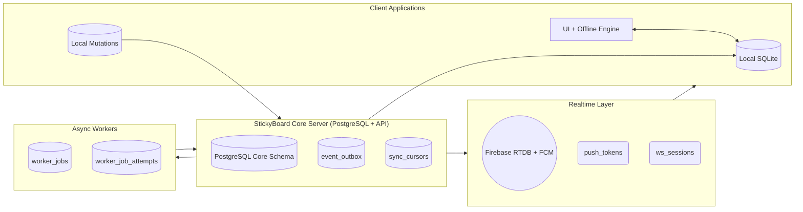
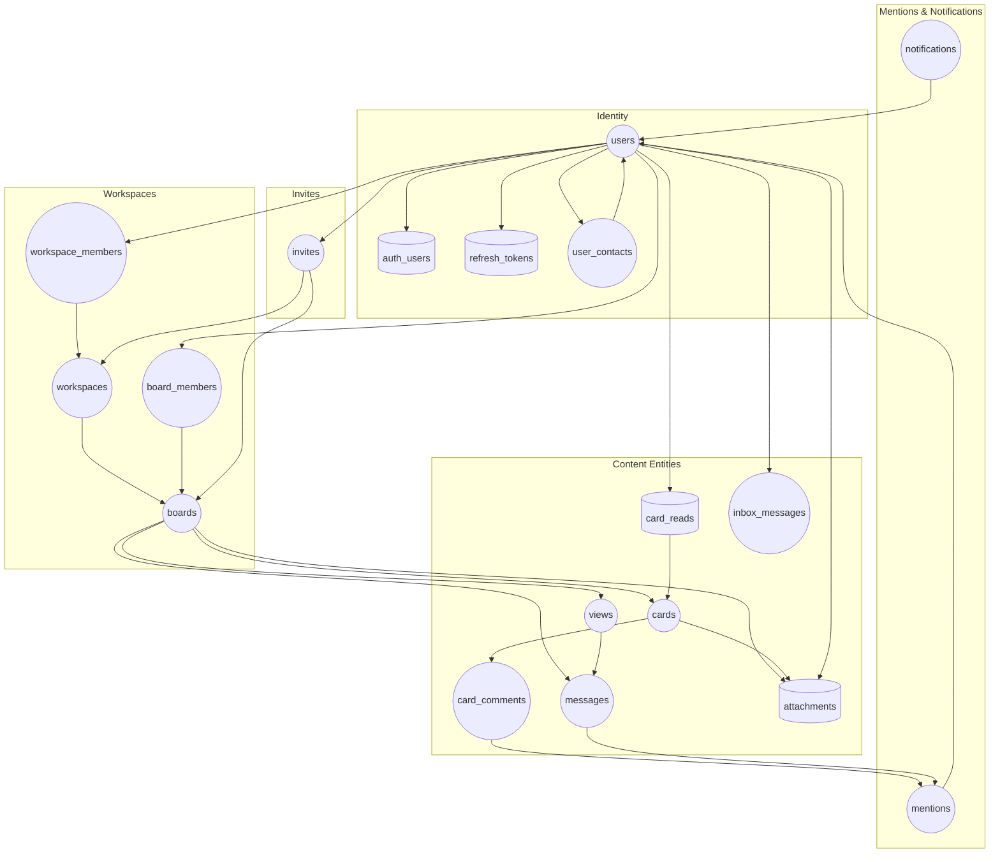
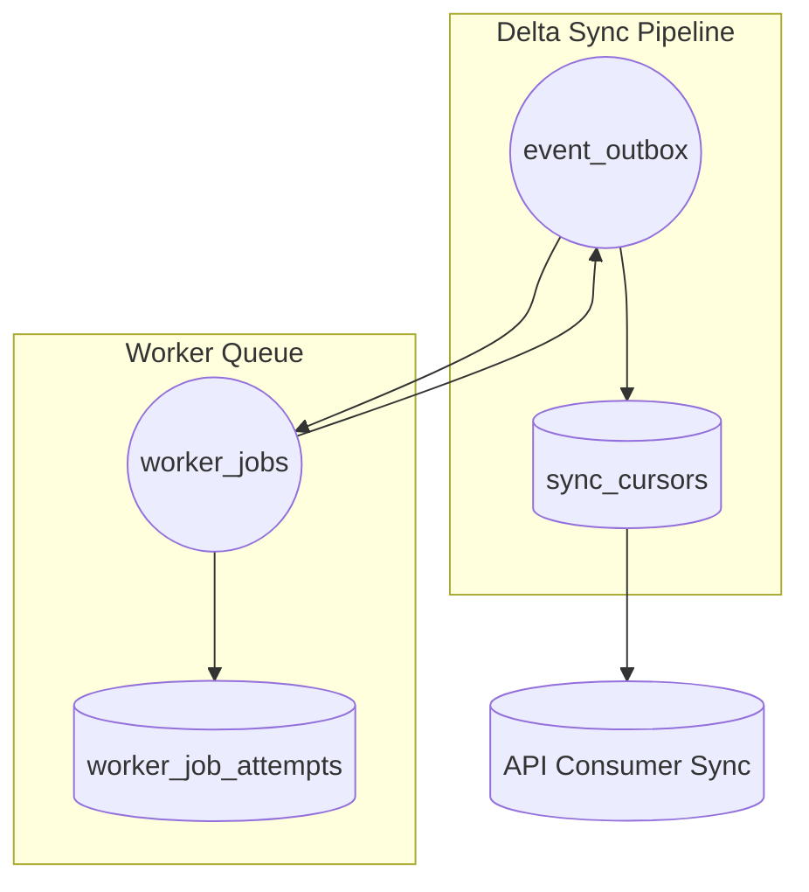
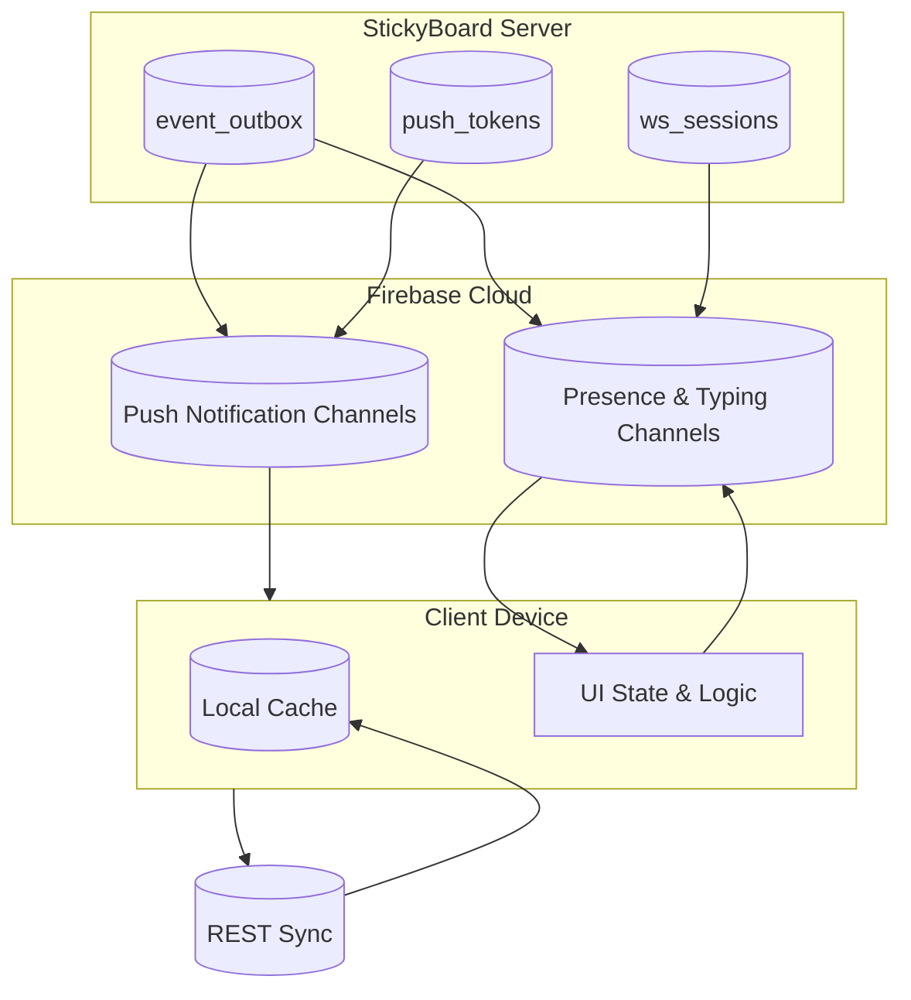

## StickyBoard Architecture — Final Freeze (Matched to Schema)

### Core Principles

- Cards are the core object with rich Markdown and optional ink data.
- Progressive typing: tasks, events, checklists, etc. emerge from optional fields.
- Views are read-models over cards (Kanban, List, Calendar, Timeline, Metrics, Doc, Whiteboard, Chat).
- Workspaces replace organizations and hold boards.
- Sharing a board = sharing its workspace (optional board overrides allowed).
- Attachments stored in PostgreSQL metadata + CDN object key.
- Realtime sync via **event_outbox + Firebase fan-out**, not WebSockets server logic.
- Offline split:
  - Personal workspace = full offline editing
  - Shared workspace = cached read + online edit
- Triggers maintain `updated_at` and `version` for sync conflict detection.

------

## Entities & Responsibilities

| Entity               | Role                                                       |
| -------------------- | ---------------------------------------------------------- |
| **User**             | Identity, preferences, auth, contacts                      |
| **Workspace**        | Root scope (permissions, boards, attachments)              |
| **Workspace Member** | Role binding: owner/admin/member/guest                     |
| **Board**            | Project container under workspace                          |
| **Board Member**     | Optional override of workspace access                      |
| **View**             | Presentation model; UI filtering/sorting; versioned        |
| **Card**             | Markdown + optional ink, dates, checklist, tags, assignee  |
| **Attachment**       | CDN key + metadata; can be workspace/board/card            |
| **Comment**          | Threaded card discussion                                   |
| **Message**          | Board/view chat stream                                     |
| **Inbox Message**    | Direct/private messages                                    |
| **Mentions**         | Extracted @mentions (card/comment/message)                 |
| **Notifications**    | Triggered by mention/reply/events                          |
| **Refresh Token**    | Session persistence                                        |
| **Invite**           | Workspace or board invite w/ hashed token                  |
| **User Contacts**    | Lightweight social graph (pending/accepted/blocked)        |
| **Outbox Event**     | Change feed for sync + Firebase fan-out                    |
| **Worker Jobs**      | Background tasks (search index, email, reminders, cleanup) |

------

## Card Model (Aligned to SQL)

- **Content**
  - `markdown`
  - `ink_data` (JSON)
- **Optional Fields**
  - `due_date`, `start_date`, `end_date`
  - `checklist` JSON
  - `priority` (int)
  - `status` enum (`open`, `in_progress`, `blocked`, `done`, `archived`)
  - `assignee` → `users.id`
  - `tags` TEXT[]
- **Audit**
  - `created_by`, `last_edited_by`, `created_at`, `updated_at`
  - `version` bumped on update trigger
  - Soft delete: `deleted_at`

Behavior: UI unlocks "task", "event", "project" behaviors based on populated fields.

------

## Comments, Mentions, Replies

- Threaded comments (one-level via `parent_id`)
- Mentions extracted into `mentions` table:
  - `entity_type` = card | comment | message | doc | whiteboard
- Notifications created per mention or reply

Unread:

- Card thread unread tracked via `card_reads`
- Inbox unread via `read_at`

Resolution:

- Mentions resolve to **user_id**, not display name
- Avoid inside code fences

Autocomplete:

- Workspace members + accepted contacts only

------

## Views

Backed by `views` table (`kanban`, `list`, `calendar`, `timeline`, `metrics`, `doc`, `whiteboard`, `chat`)

- `layout` JSON holds serialized configuration
- `position` defines sort
- `version` auto-increments for sync clients

------

## Whiteboard

- Represented inside `views` type `whiteboard`
- Nodes stored as JSON in `layout`
- Cards can be embedded via reference IDs

CDN optional future export path (snapshot export job later).

------

## Attachments

Stored metadata in DB, file in CDN:

| Column                                | Meaning                        |
| ------------------------------------- | ------------------------------ |
| `workspace_id`, `board_id`, `card_id` | scope                          |
| `cdn_key`                             | CDN object key                 |
| `checksum`, `size`, `mime`            | integrity / metadata           |
| `folder_path`                         | virtual file tree inside board |
| `version`                             | revision tracking for sync     |

Signed URL generation via API → CDN.

------

## Identity, Contacts, Roles

- PostgreSQL authoritative identity
- `auth_users` for local login + `refresh_tokens`
- `user_contacts` for friend system (pending/accepted/blocked)
- `groups` text[] exists but future-use only (Linux-style tags)

Roles:

- `workspace_role`: owner/admin/member/guest
- Board inherits workspace unless overridden in `board_members`

ACL:

- Workspace membership grants access to all boards
- Board membership overrides are optional fine-tuning

------

## Sync Model (Postgres + Firebase)

### Personal Workspaces

- Owned workspace
- Full offline data & writes
- Sync via:
  - updated_at
  - version
  - local mutation queue

### Shared Workspaces

- Cached offline read
- Online write
- Deterministic conflict resolution:
  - last-write wins with version bump

### Event Flow

DB change → trigger → `event_outbox` row → worker → Firebase push → devices apply diff

`sync_cursors` tracks last event delivered per scope.

------

## Direct / Inbox Messages

- Stored in `inbox_messages`
- Used for:
  - Friend invites
  - Private messages
  - System notifications (optional)
- Visible in global inbox UI

------

## Notifications

Triggered by:

- Mentions
- Comment replies
- Message replies
- Assignment changes (via card `assignee`)
- Invite accepted (system)

Stored in `notifications`, status via `read` + `read_at`.

------

## Outbox + Realtime

### Outbox (`event_outbox`)

Contains:

- entity type
- ids
- workspace_id / board_id
- payload JSON
- monotonic cursor

Triggers emit events for:

- Workspace membership
- Board membership
- Invites

App workers will later add emitters for:

- Cards
- Views
- Comments
- Messages
- Attachments

Firebase usage:

- Fan-out events to subscribed clients
- No custom socket infra

------

## Workers

`worker_jobs` processes:

- Search indexing
- Notification fan-out
- Reminder checks (due dates)
- Invite email
- CDN garbage collection
- Periodic compaction (future)

`worker_job_attempts` tracks history for retry logic.

------

## Offline Policy

| Mode               | Capability                         |
| ------------------ | ---------------------------------- |
| Personal Workspace | Full offline read/write            |
| Shared Workspace   | Cached read, online write          |
| Direct Messages    | Cached + will be optimized later   |
| Attachments        | Metadata synced, file lazy-fetched |

------

## Top-Level System Split

## **Core DB Diagram** (Collaboration + Identity)

## Workers & Outbox Processing

## Realtime Layer (Firebase Only)

