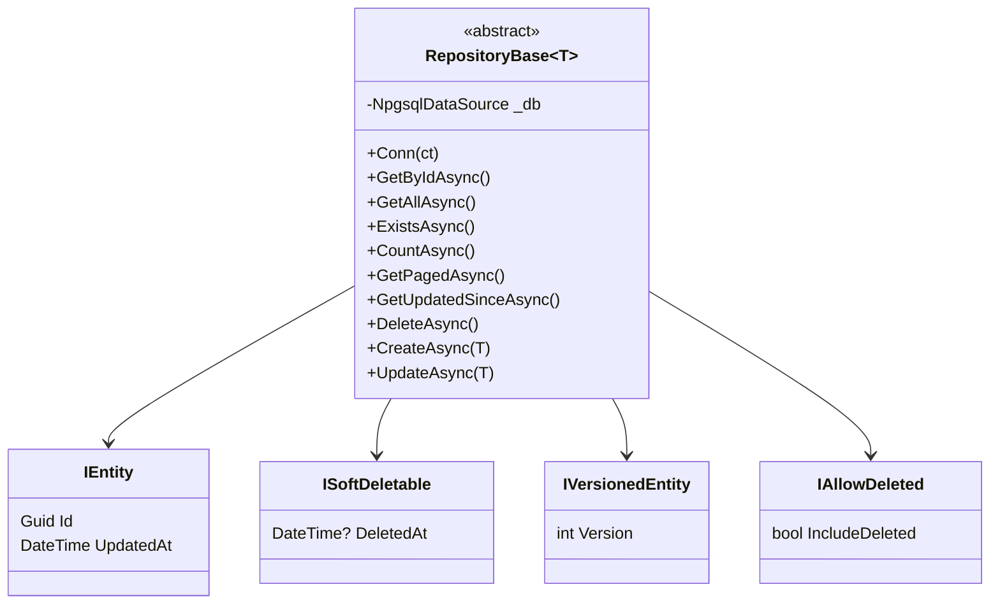
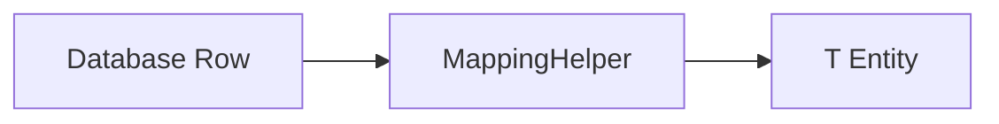
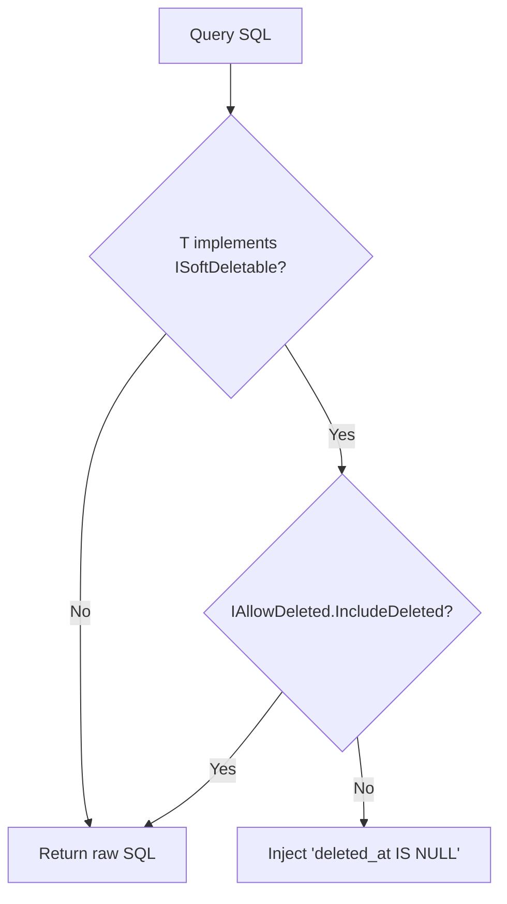
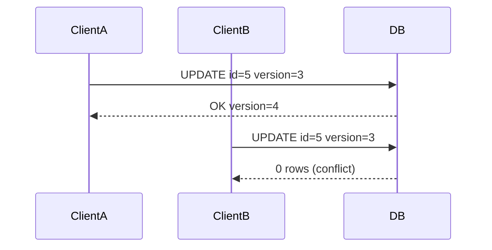
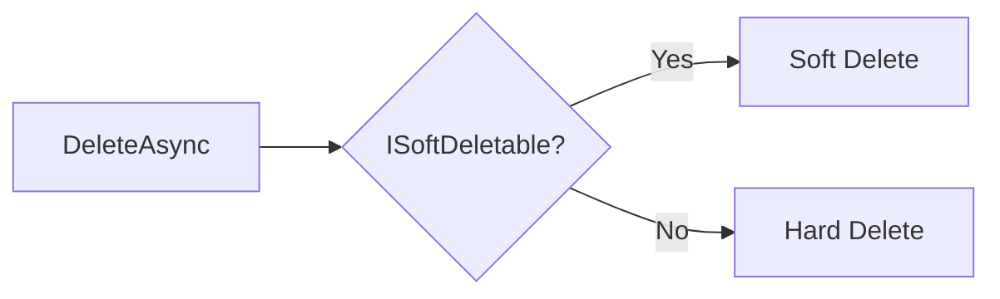
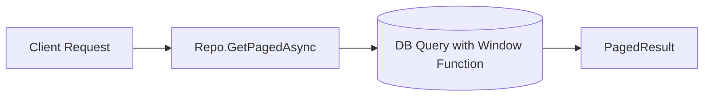
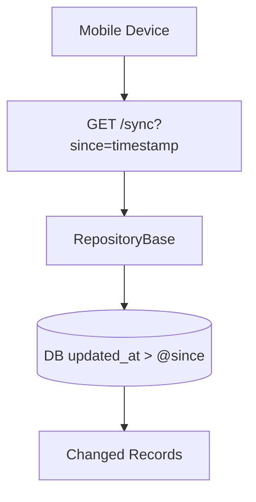
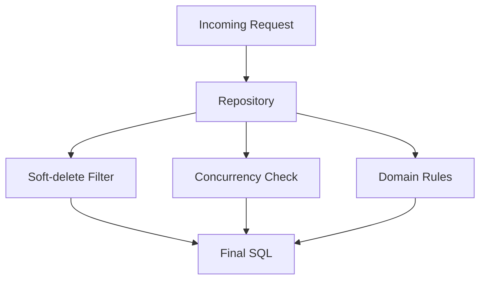

# StickyBoard Data Access Layer (DAL)

## Overview

The StickyBoard DAL uses a lightweight repository pattern on top of Npgsql. It avoids ORMs and provides full control over SQL, ensuring predictable performance, clear logic, and strict safety rules.

This document explains the architecture, soft deletion system, versioning, concurrency rules, and sync mechanisms.

------

## Core Architecture



------

## Table Name Resolution

Each entity resolves its table name in one of two ways:

- Explicit via `[Table("name")]`
- Implicit via lowercase type name

------

## Mapping System

The DAL uses a single mapping function:

```csharp
protected virtual T MapRow(NpgsqlDataReader r)
```

This ensures that all repositories share consistent mapping behavior.



------

## Soft Delete System

Soft deletion is automatic if the entity implements `ISoftDeletable`.

Soft-delete behavior:

- `SELECT` queries automatically filter `deleted_at IS NULL`
- `DELETE` becomes `UPDATE table SET deleted_at = NOW()`

### Filtering Logic



------

## Optimistic Concurrency

Versioned entities use:

- WHERE `id = @id AND version = @version`
- UPDATE increments version

This prevents stale overwrites during multi-device usage.



------

## Hard Delete vs Soft Delete

### Rules

- If `ISoftDeletable`: use soft delete
- Otherwise: hard delete
- Some repositories override delete entirely and forbid it



------

## Paging System

Uses a single-query window function:

```
SELECT *, COUNT(*) OVER() AS total_count
FROM table
ORDER BY updated_at DESC
LIMIT @limit OFFSET @offset;
```

Provides:

- deterministic pagination
- only one round-trip to the DB



------

## Sync Model (Delta Queries)

Two main methods:

- `GetUpdatedSinceAsync(DateTime since)`
- `GetUpdatedSincePagedAsync()`



------

## Security Principles

The DAL enforces:

- mandatory parameterized SQL
- no dynamic string concatenation
- strict domain rules via explicit overrides
- predictable delete safety via ISoftDeletable
- optimistic concurrency using version checks

------

## Error Prevention & Safety

### Protection Layers

1. **ORM-like safety without ORM bloat**
2. **Query injection protections** (params only)
3. **Soft delete by default**
4. **Version checks** to avoid data races
5. **Controlled deletes** in social/contact logic



------

## Consistency Guarantees

The DAL guarantees:

- consistent table access patterns
- uniform SQL filtering
- deterministic mapping
- stable sync behavior across all devices
- secure and predictable lifecycle for deletable entities

------

# Summary

The StickyBoard DAL is a highly predictable architecture providing:

- Soft delete with override capability
- Optimistic concurrency
- Delta sync support for devices
- Strict domain rule enforcement
- SQL-level transparency and safety

It is efficient, secure, maintainable, and production-ready.