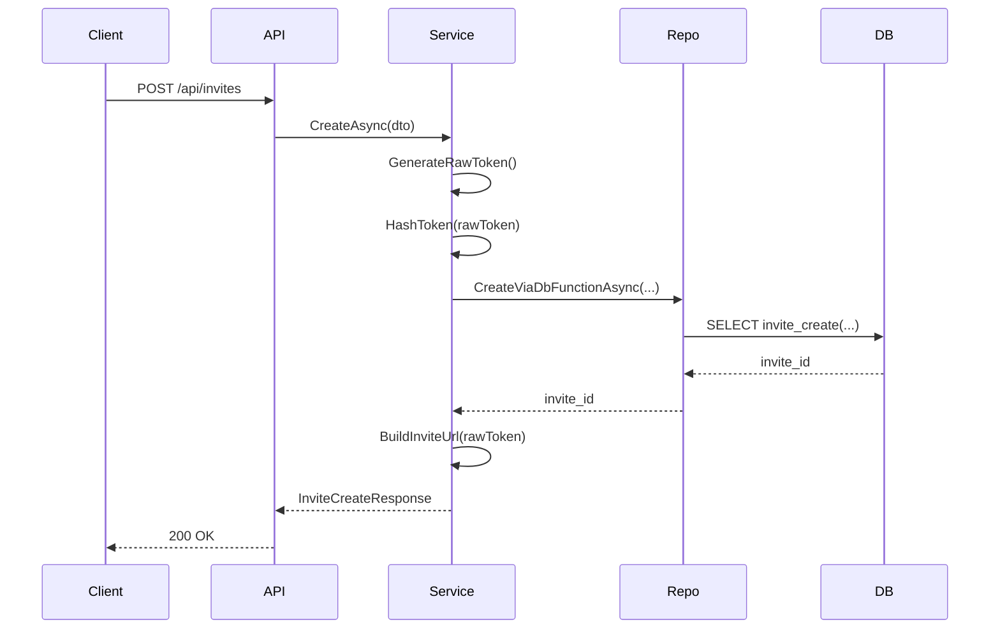
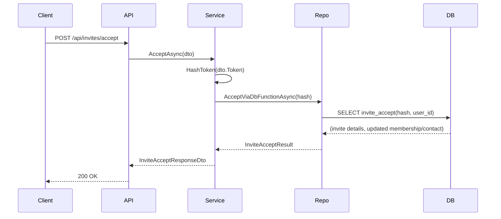
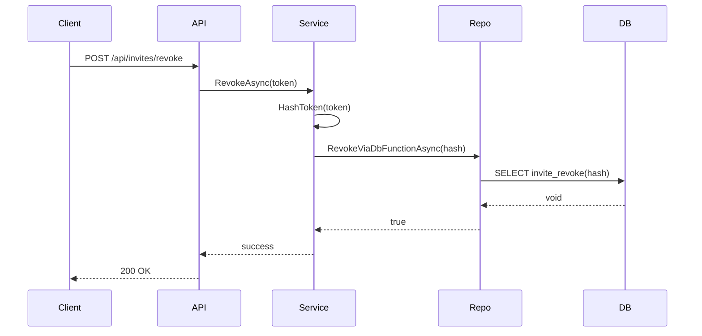
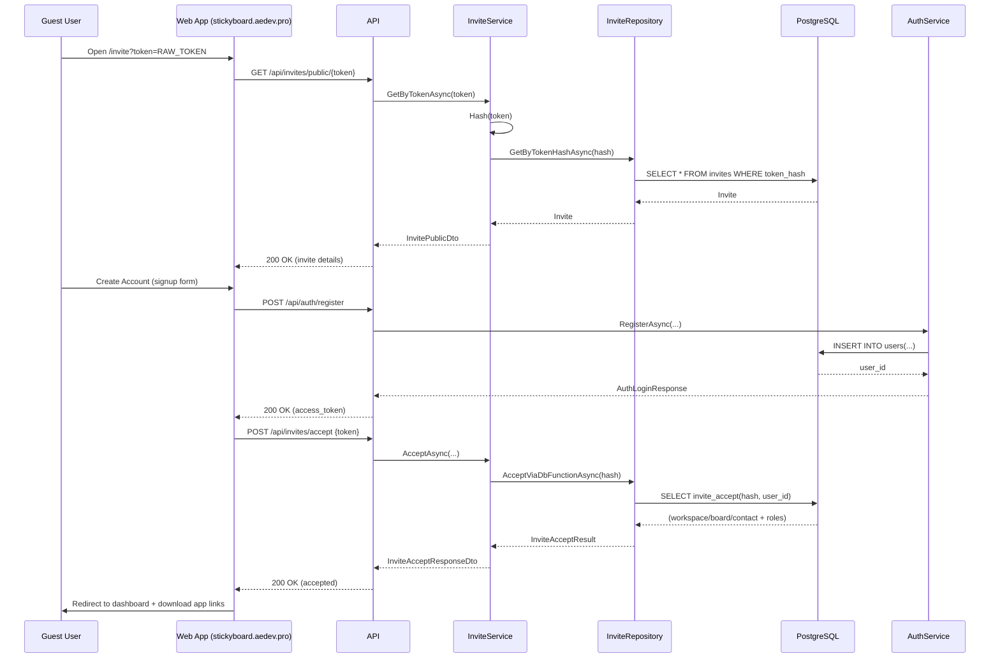
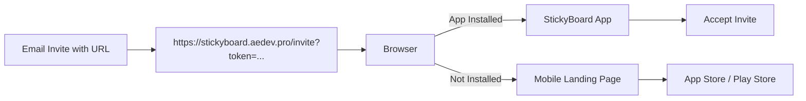
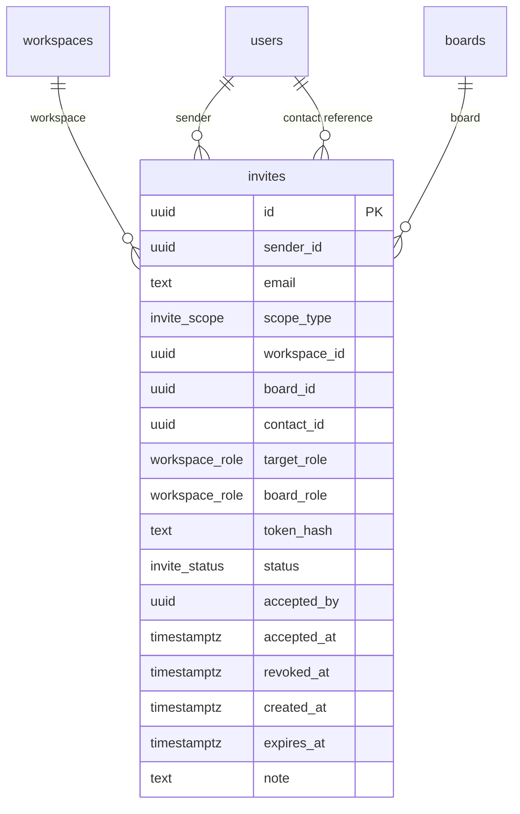
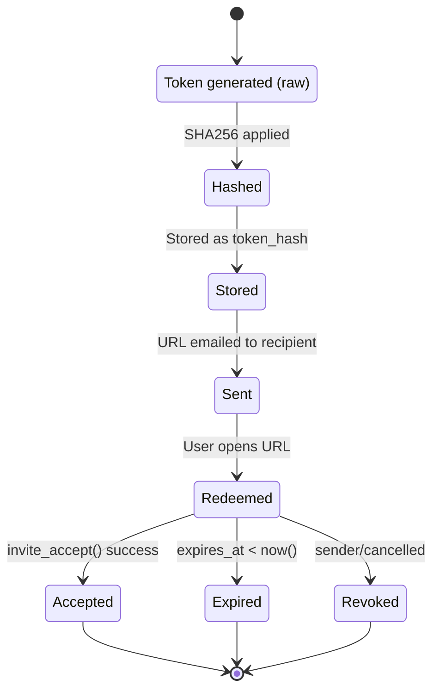
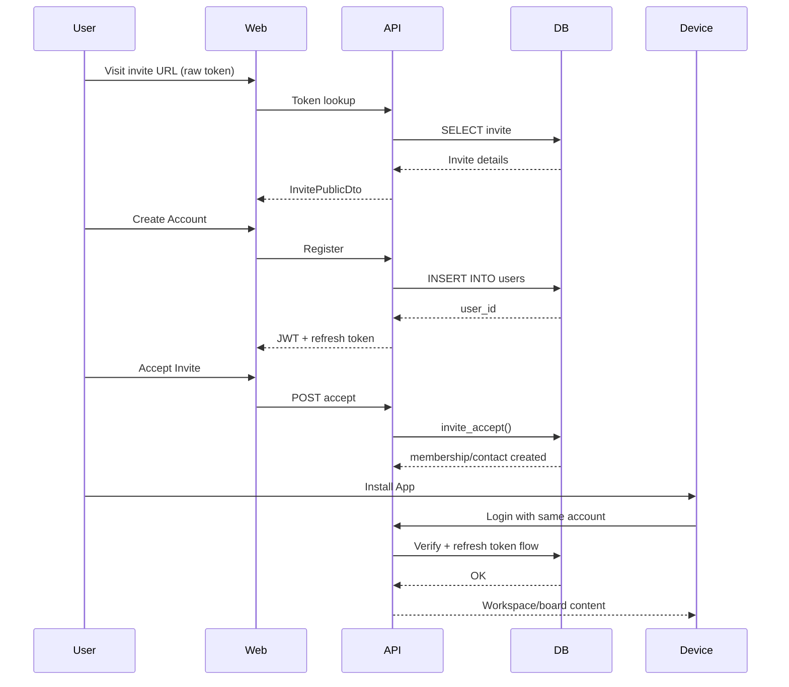

# StickyBoard Invite System – Technical Documentation

## Overview

The StickyBoard invite system enables cross-platform onboarding for workspace, board, and contact collaboration. The process ensures secure invitation flows using cryptographically strong tokens, strict server-side validation, and database-driven business logic. All core operations—creation, acceptance, revocation—are executed inside PostgreSQL functions to ensure transactional integrity.

This document provides a complete technical overview of:

- Data model and database schema
- Invite scopes and behavioral rules
- Token generation and hashing
- Repository and DB function interaction
- Service-level orchestration
- Public URL handling
- Security guarantees

------

## 1. Data Model

### 1.1 Invite Table Structure

Invites are stored in the `invites` table with the following fields:

- `id` (uuid)
- `sender_id` (uuid)
- `email` (text)
- `scope_type` (`invite_scope` enum)
- `workspace_id` (uuid?)
- `board_id` (uuid?)
- `contact_id` (uuid?)
- `target_role` (workspace_role?)
- `board_role` (workspace_role?)
- `token_hash` (text)
- `status` (`invite_status` enum)
- `accepted_by` (uuid?)
- `accepted_at` (timestamptz?)
- `revoked_at` (timestamptz?)
- `created_at` (timestamptz)
- `expires_at` (timestamptz)
- `note` (text?)

### 1.2 Scope Enforcement

The invite system supports three explicit scopes:

- `workspace`: workspace-level membership
- `board`: board-level membership
- `contact`: contact/friend relationship

A CHECK constraint enforces correct structure:

- Workspace → requires `workspace_id`, others null
- Board → requires `board_id`, others null
- Contact → both `workspace_id` and `board_id` null; `contact_id` optional

### 1.3 Uniqueness Rules

A unique index prevents multiple pending invites for the same destination email and identical scope.

### 1.4 Outbox Event Integration

All INSERT/UPDATE/DELETE operations trigger an `event_outbox` record for worker processing.

------

## 2. Token Handling

### 2.1 Raw Token

- Generated server-side using `RandomNumberGenerator`
- 32 random bytes → 256-bit token
- Encoded as lowercase hex
- Exposed only to recipients (via URLs)

### 2.2 Token Hashing

Before storage, raw tokens are hashed using SHA-256:

- The database stores only the hash
- Raw token never leaves application memory
- Provides leak resistance and replay protection

------

## 3. Database Functions

All business logic resides in PostgreSQL for atomicity.

### 3.1 `invite_create()`

Responsibilities:

- Validate scope combinations
- Compute expiration timestamp
- Insert invite row
- Return new invite ID

### 3.2 `invite_accept()`

Responsibilities:

- Validate token hash and expiration
- Perform membership upsert (workspace or board)
- Perform contact reciprocity insertion for contact invites
- Mark invite as accepted
- Return accepted scope and identifiers

### 3.3 `invite_revoke()`

Responsibilities:

- Mark pending invites as revoked
- Record revocation timestamp

------

## 4. Repository Layer

The `InviteRepository` orchestrates all persistence.

### 4.1 Core Responsibilities

- Execute DB helper functions (`invite_create`, `invite_accept`, `invite_revoke`)
- Perform lookup queries (`GetByEmail`, `GetBySender`, `GetByTokenHash`)
- Map records to domain models

### 4.2 Delegation Model

The repository does not implement business logic. All domain decisions occur within PostgreSQL functions for:

- Transactional correctness
- Race-condition prevention
- Uniform behavior across all API nodes

------

## 5. Service Layer

The `InviteService` prepares DTOs and orchestrates logic.

### 5.1 Create Flow

Steps:

1. Generate cryptographically secure raw token
2. Compute token hash
3. Call `invite_create()` via repository
4. Build canonical public URL
5. Return `InviteCreateResponseDto`

### 5.2 Accept Flow

1. Hash provided raw token
2. Execute `invite_accept()` via repository
3. Map result to `InviteAcceptResponseDto`

### 5.3 Revoke Flow

- Hash token
- Execute `invite_revoke()`

### 5.4 Lookup Functions

- Get invites by sender
- Get invites by email
- Get invite metadata from raw token (via hashed lookup)

------

## 6. Public URL Generation

### 6.1 Canonical URL

Used in all invites:

```
https://stickyboard.aedev.pro/invite?token={rawToken}
```

### 6.2 Optional Variants

- Deep link (`stickyboard://invite?token={rawToken}`)
- Mobile landing page
- Download redirect pages

All variants safely expose the raw token.

------

## 7. Security Considerations

### 7.1 No Raw Token Storage

Only the token hash is persisted, preventing database compromise from yielding direct invite access.

### 7.2 Constant-Time Hashing

SHA-256 ensures deterministic and collision-free mapping.

### 7.3 Expiration Enforcement

The database ensures expiration is checked server-side.

### 7.4 Non-Replay Acceptance

Once accepted or revoked, the token becomes unusable.

### 7.5 Mandatory Scope Validation

Database constraints ensure no malformed invites can be inserted.

------

## 8. End-to-End Flow Summary

### 8.1 Creation

```
Service → Generate Raw Token → Hash → Repository → DB Function → Invite ID
Service → Build URL → Return to client
```

### 8.2 Acceptance

```
Client → Submit Raw Token
Service → Hash → Repository → DB Function → Membership Upsert
Service → Return mapped result
```

### 8.3 Revocation

```
Service → Hash → Repository → DB Function → Status Updated
```

------

## 9. Extensibility

The architecture supports future extensions with minimal change:

- Additional invite scopes
- External identity providers
- Onboarding flows
- Analytics and tracking events
- Background workers listening on outbox events

------

## 10. Conclusion

The invite system is designed for performance, security, and cross-platform expansion. By centralizing domain rules in PostgreSQL functions and using hashed tokens, the pipeline is both robust and tamper-resistant. The repository and service layers are cleanly separated, providing a stable API boundary for further development and integration.

This document should be used as the primary reference for future maintainers and contributors implementing invite-related features or flows.

## Mermaid Diagrams

### Invite Creation Flow



### Invite Acceptance Flow



### Invite Revocation Flow



## Additional Invite System Architecture

### Account Creation From Invite (Non-User → New User)



------

## Cross-Platform Deep Link Architecture

### Canonical Public HTTP URL

```
https://stickyboard.aedev.pro/invite?token={RAW_TOKEN}
```

Used everywhere: email, web, cross-platform.
 Redirects to:

- login/signup if necessary
- invite acceptance
- optional platform selector (iOS/Android/Desktop)

### Mobile Deep Links (Direct App Launch)

```
stickyboard://invite?token={RAW_TOKEN}
```

Behavior:

- If app installed → opens InviteAccept screen
- If not installed → OS fallback to browser → canonical URL

### Android App Link (Digital Asset Links)

```
https://stickyboard.aedev.pro/invite?token={RAW_TOKEN}
```

When configured in assetlinks.json, Android can launch the app directly.

### iOS Universal Link

```
https://stickyboard.aedev.pro/invite?token={RAW_TOKEN}
```

When configured in apple-app-site-association, iOS auto-opens the app.

### Optional Mobile Landing Page

```
https://stickyboard.aedev.pro/mobile/invite?token={RAW_TOKEN}
```

Used when you want rich UI:

- Detect device type
- Offer "Open App" / "Install App" / "Use Web"

------

## Combined Cross-Platform Deep Link Flow



------

## Database-Level Architecture (Invites)



------

## Invite Token Lifecycle (End-to-End)



------

## Multi-Device Continuity Flow



------

## Summary

This extended documentation now includes:

- Cross-platform deep link strategies
- Full non-user → account creation → invite acceptance pipeline
- Universal links & app link behavior
- Additional Mermaid diagrams (sequence, state, flowchart, ERD)
- Multi-device onboarding and activation flows

If you want:

- Email template documentation
- Security audit notes
- Abuse-prevention and rate-limit design
- Automatic resend or verification flow
   Just let me know.