# StickyBoard – Conceptual Data Integrity & Domain Logic

> Conceptual document – describes **invariants, rules, and lifecycle behaviors** enforced by the schema, triggers, and DB helpers. No code is authoritative here; this is an architectural map for backend and worker devs.

------

## 1. Global Principles

### 1.1 Tenant Model & Identity

- Single logical deployment, **multi‑tenant by workspace**, soft‑partitioned via `workspace_id` and `board_id` columns and the `event_outbox.workspace_id` / `board_id` routing.
- **User identity** is global:
  - Primary table: `users`.
  - Local auth/role info: `auth_users`.
  - Everything else references `users.id`.

### 1.2 Time & Versioning

- Entities with `updated_at` use `set_updated_at()` so **every UPDATE must pass through a trigger**.
- Entities with `version` use `bump_version()` so **every logical update increments the integer revision**.
- Consumers can treat `updated_at` as coarse clock and `version` as conflict‑detection / optimistic concurrency marker.

### 1.3 Soft Deletion Strategy

- Tables with `deleted_at` implement **soft delete** semantics.
- Soft‑deleted rows:
  - Remain for audit and sync.
  - Are excluded by default by repository logic (`WithSoftDelete` / `IncludeDeleted` flag).
- True hard deletes are mostly reserved for:
  - Security‑sensitive tables (`refresh_tokens`, `file_tokens`),
  - Ephemeral tables (some worker‑related),
  - Cascades (e.g. `ON DELETE CASCADE` on membership).

### 1.4 Outbox & Sync

- **Any change to core domain entities** must be mirrored to `event_outbox` via triggers.
- `event_outbox` gives **append‑only change feed**, ordered by `cursor`.
- `sync_cursors` tracks, per user + scope, which cursor they last fully processed.
- Workers / realtime bridges are required to:
  - Poll / stream `event_outbox`.
  - Apply fan‑out to Firebase / WS / push.

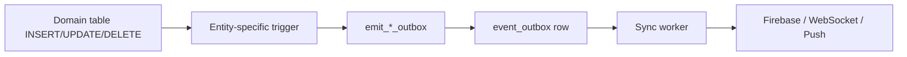

------

## 2. Users, Auth & Tokens

### 2.1 `users`

- Global identity for people.
- Key invariants:
  - `email` unique and normalized via `idx_users_lower_email`.
  - Soft‑deletable via `deleted_at`.
  - Any update must pass `trg_users_updated`.
- Outbox:
  - `emit_user_outbox()` sends full `NEW` or `OLD` row into `event_outbox` with topic `user`.

### 2.2 `auth_users`

- Local credential and role for a given `user_id`.
- Invariants:
  - One `auth_users` row per `users.id` (PK = `user_id`).
  - `role` typed via `user_role` enum (`user | admin | moderator`).
- Updates:
  - `trg_auth_users_upd` maintains `updated_at`.
- Relationship expectations:
  - Login / auth pipeline should always treat **`users` as canonical identity**, `auth_users` as **one credential flavor**.

### 2.3 `refresh_tokens`

- Opaque refresh token on the wire, **stored as `token_hash`** (sha256 hex).
- Invariants:
  - `token_hash` is PK, never store raw token.
  - A token is **valid** if `revoked = FALSE` and `expires_at > now()`.
  - Foreign key to `users(id)` with `ON DELETE CASCADE` means revoking a user kills all tokens.
- Indexes:
  - `ix_rt_user` for “all tokens by user”.
  - `ix_rt_validity` for “active and expiring soon” scans.
- Lifecycle expectations:
  - On login/refresh:
    - Generate raw token (256 bits), hash and store.
    - Optionally link to `client_id`, `user_agent`, `ip_addr` for security telemetry.
  - On rotation:
    - `replaced_by` links chain of tokens. Workers may eventually prune entire chains.
  - On security events:
    - “Revoke all sessions” → `UPDATE refresh_tokens SET revoked = TRUE` by `user_id`.

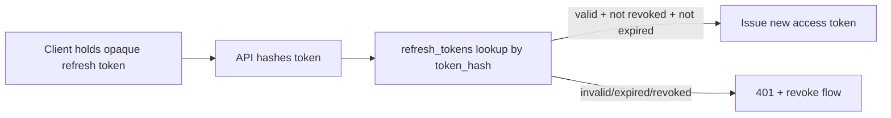

------

## 3. Contacts & Social Graph

### 3.1 `user_contacts`

- Represents **direct contact relationship** from `user_id` to `contact_id`.
- Primary key is composite (user, contact) to allow symmetrical pairs.
- `status` is `contact_status` enum:
  - `pending` → invitation or follow request.
  - `accepted` → active contact.
  - `blocked` → blocked relationship.
- Triggers:
  - `trg_user_contacts_upd` maintains `updated_at`.
  - `emit_user_contact_outbox()` writes changes to outbox with topic `user_contact`.
- Higher‑level behaviors (enforced by services / helpers):
  - Reciprocal acceptance is handled through `invite_accept` helper (see invites).
  - Direct row manipulations should be rare; APIs should use **contact service** semantics.

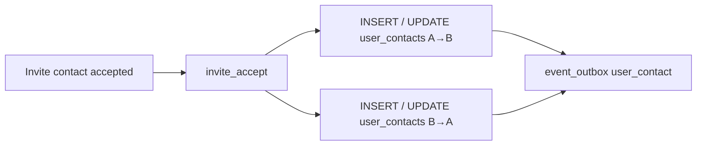

------

## 4. Workspaces, Membership & Roles

### 4.1 `workspaces`

- Top‑level collaboration containers.
- Invariants:
  - `created_by` references `users(id)` but is nullable (historical resilience).
  - Soft deletable via `deleted_at`.
  - `trg_ws_upd` keeps `updated_at` fresh.
- Outbox:
  - `emit_workspace_outbox()` writes topic `workspace` with `workspace_id = id`.

### 4.2 `workspace_members`

- Binds `user_id` to a workspace with a `workspace_role`:
  - `owner`, `admin`, `moderator`, `member`, `guest`.
- Composite PK (`workspace_id`, `user_id`).
- Invariants:
  - On delete of workspace or user, membership is automatically removed.
- Outbox:
  - `emit_workspace_member_outbox()` with topic `workspace_member`.

### 4.3 Conceptual Role Semantics

- `workspace_role` is both an **authorization label** and an **ordering** for privileges:
  - Highest privilege: `owner`.
  - Then `admin`, `moderator`, `member`, `guest`.
- Rules intentionally enforced in DB functions (e.g. invites):
  - On `invite_accept` for workspace:
    - `INSERT workspace_members` with `COALESCE(target_role, 'member')`.
    - On conflict, `SET role = GREATEST(EXCLUDED.role, workspace_members.role)`.
      - This ensures **role can only ever be promoted by the DB helper**, not downgraded accidentally.

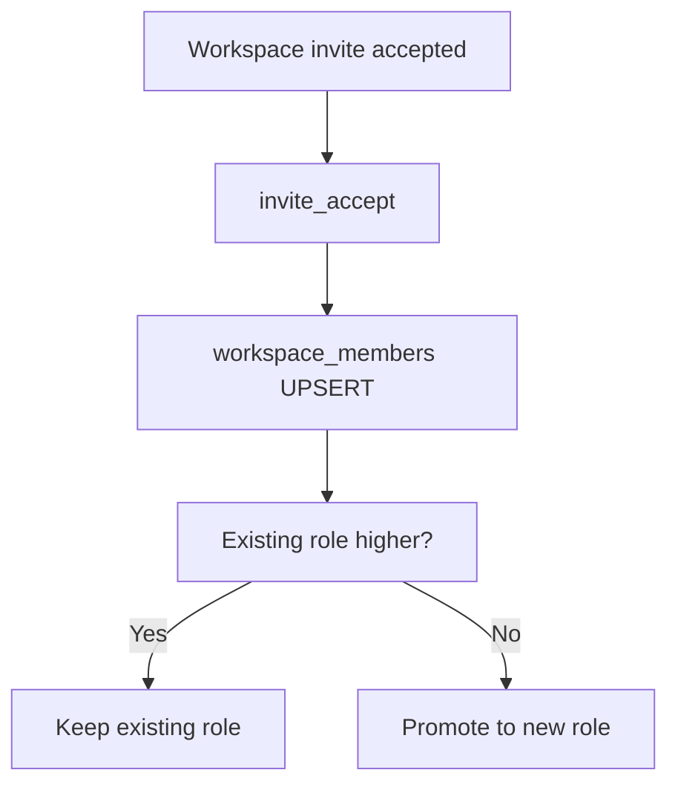

> Note: we still need a **workspace bootstrap invariant**: on `workspaces` creation, the creator should become an `owner` in `workspace_members`. That should be implemented in a dedicated helper or trigger.

------

## 5. Boards & Board-Level Membership

### 5.1 `boards`

- Belong to a single workspace via `workspace_id`.
- Can be soft‑deleted.
- `theme` and `meta` are free‑form JSON.
- `created_by` references the creator but is optional.
- `trg_boards_upd` keeps `updated_at` consistent.
- Outbox via `emit_board_outbox()`:
  - Emits topic `board` with both `workspace_id` and `board_id` populated for routing.

### 5.2 `board_members`

- Optional per‑board override of workspace membership.
- Invariants:
  - Role is same `workspace_role` enum, but interpreted at board level.
  - If a user is not a workspace member, board membership **should be considered anomalous** — this must be prevented/enforced by application logic or helper functions when you introduce board‑specific membership flows.
- Outbox via `emit_board_member_outbox()`.

### 5.3 Role Resolution Concept

- Effective role for a board can be modeled as:

```text
EffectiveBoardRole(user, board) = max(
  WorkspaceRole(user, board.workspace),
  BoardRoleOverride(user, board)
)
```

- `invite_accept` for board scope enforces this on insert:
  - `ON CONFLICT (board_id, user_id) DO UPDATE SET role = GREATEST(EXCLUDED.role, board_members.role)`.

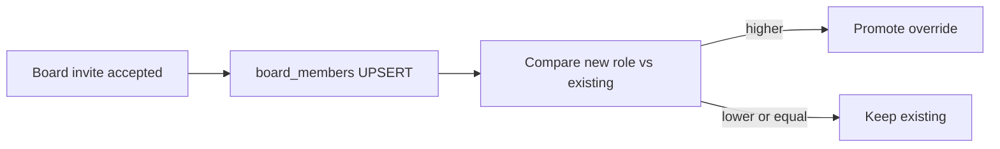

------

## 6. Views, Cards & Comments

### 6.1 `views`

- Logical presentations of a board (`kanban`, `list`, `calendar`, etc.).
- `layout` JSON stores view‑specific configuration.
- `position` orders views per board.
- Versioned + soft‑deletable:
  - `trg_views_upd` sets `updated_at`.
  - `trg_views_version` bumps `version` on every update.
- Outbox via `emit_view_outbox()`:
  - Resolves `workspace_id` from `board_id` using `_sb_ws_from_board()`.

### 6.2 `cards`

- Core work item entity.
- Belongs to a `board_id`.
- Contains content fields, scheduling fields (`start_date`, `end_date`, `due_date`), `checklist`, `priority`, `tags`, `status` (enum), assignment info.
- Versioning + soft delete:
  - `trg_cards_upd` + `trg_cards_version`.
- Indexes support queries by board, status, and recency (`ix_cards_board_updated`).
- Outbox via `emit_card_outbox()`:
  - Same workspace resolution as views.

### 6.3 `card_reads`

- Per‑user **read checkpoint** for card threads.
- Composite PK: `(card_id, user_id)`.
- `last_seen_at` is the only mutable field.
- No outbox yet; read status is mostly **local state** and can be pulled on demand.

### 6.4 `card_comments`

- Threaded comments for cards.
- `parent_id` forms a comment tree.
- Uses soft deletion.
- Outbox via `emit_card_comment_outbox()` using `_sb_board_ws_from_card()`.

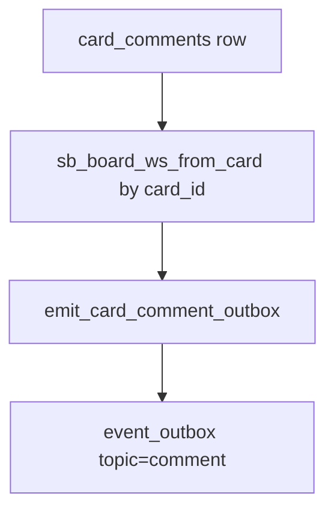

------

## 7. Chat & Inbox

### 7.1 `messages`

- Channelized messages for boards/views/system.
- `channel` is restricted by CHECK to `('board','view','system')`.
- Soft deletable.
- Outbox via `emit_message_outbox()`:
  - If `board_id` present, derive `workspace_id` from board.
  - Else, if `view_id` present, derive `(board_id, workspace_id)` from `_sb_board_ws_from_view()`.

### 7.2 `inbox_messages`

- Direct messages (user to user), conceptually `channel = 'direct'` but stored separately.
- Mandatory `receiver_id`, optional `sender_id` (null on user delete, thanks to `ON DELETE SET NULL`).
- Outbox via `emit_inbox_outbox()` with topic `inbox`.
- No soft delete – direct messages are either present or removed.

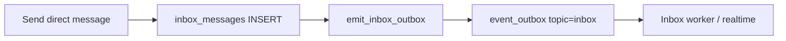

------

## 8. Mentions & Notifications

### 8.1 `mentions`

- Normalized representation of `@user` references in multiple surfaces.
- `entity_type` limited to `'card','comment','message','doc','whiteboard'`.
- Invariants:
  - `mentioned_user` must exist.
  - `author_id` is optional but strongly recommended.
- Outbox via `emit_mention_outbox()`.
- Notifications for mentions are not automatic at DB level; **workers look at mentions** and may generate notifications.

### 8.2 `notifications`

- Represents user‑visible events: `mention`, `reply`, `assignment`, `system`.
- `read` + `read_at` allow per‑user consumption state.
- Outbox via `emit_notification_outbox()`.
- Conceptual flow:
  - Domain event occurs (comment added, mention created, assignment changed).
  - A worker or service writes `notifications` rows.
  - Triggers push to outbox, then to Firebase/WS/push.

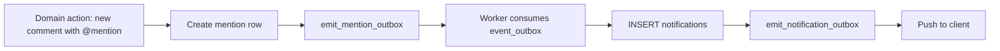

------

## 9. Attachments, Variants & File Tokens

### 9.1 `attachments`

- Logical file entity, tied to workspace/board/card.
- Invariants:
  - Must carry `storage_path` – canonical location on CDN.
  - `is_public` controls whether link can be resolved without `file_tokens`.
  - `status` is freeform text but typically `ready`, `processing`, `failed`.
- Versioning triggers ensure **immutable view of file metadata over time**.
- Outbox via `emit_attachment_outbox()` which:
  - Tries to infer `board_id` from `card_id` when necessary.
  - Derives `workspace_id` from the board.

### 9.2 `attachment_variants`

- Worker‑generated derivatives: thumbnails, previews, transcodes.
- Uniqueness: `(parent_id, variant)`.
- No outbox, no soft delete – these are internal representation details.
- Triggers are disabled to avoid accidental `set_updated_at`/outbox if someone later adds triggers.

### 9.3 `file_tokens`

- Short‑lived or revocable access grants for attachments (and optionally variants).
- Invariants:
  - `secret` is binary random data; used to derive HMAC signatures.
  - `audience` distinguishes **download vs preview vs inline** scopes.
  - Valid tokens: `revoked = false` and `expires_at > now()`.
- Index supports efficient lookup of valid tokens by attachment.

Conceptually, a file download flow looks like:

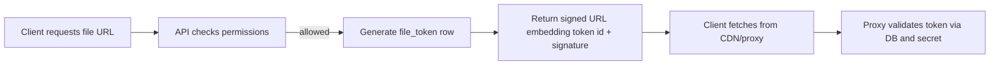

------

## 10. Invites

### 10.1 `invites`

- Handles three scope types via `invite_scope` enum:
  - `workspace` → join workspace as some role.
  - `board` → join board (and implicitly workspace) with role override.
  - `contact` → become contacts with the sender.
- Invariants:
  - `scope_type` + `workspace_id`/`board_id`/`contact_id` must pass `invites_scope_valid` CHECK.
  - For `workspace` scope, `target_role` must be non‑null (`invites_workspace_role_req`).
  - `token_hash` is stored, raw token never is.
  - Unique per **email + scope + entity** for `pending` invites via `idx_invites_email_scope`.
- Outbox through `emit_invite_outbox()` with a trimmed payload optimized for notifications.

### 10.2 Helper: `invite_create`

- Encapsulates insert logic:
  - Computes `expires_at = now() + p_expires_in`.
  - Ensures proper `scope_type` combination; additional validation can be layered in C#.

### 10.3 Helper: `invite_accept`

- Central piece of cross‑table integrity:
  - Locks the matching `invites` row `FOR UPDATE` by `token_hash`, `status = 'pending'`, `expires_at > now()`.
  - If not found, raises `invalid_or_expired_invite`.
  - Depending on `scope_type`:
    - `workspace` → `workspace_members` UPSERT with role upgrade semantics.
    - `board` → `board_members` UPSERT with role upgrade semantics.
    - `contact` → symmetric rows in `user_contacts` both directions, upgrading to `accepted`.
  - Marks invite as `accepted`, sets `accepted_at`, `accepted_by`.
  - Returns a compact row describing what changed so services can react.

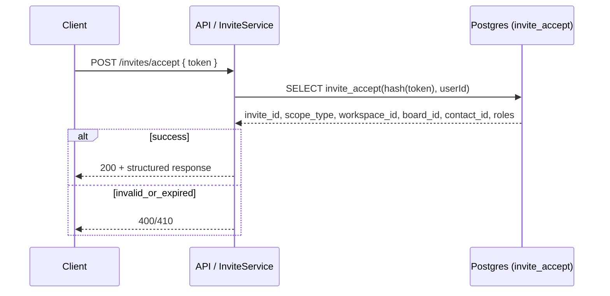

### 10.4 Helper: `invite_revoke`

- `UPDATE invites SET status = 'revoked', revoked_at = now()` for pending invites.
- No effect if invite already `accepted`, `expired`, or `revoked`.

------

## 11. Sync Primitives & Workers

### 11.1 `event_outbox`

- Single global stream of domain changes.
- Invariants:
  - `cursor` is a monotonic `BIGSERIAL`.
  - `topic` is a small finite set of strings mapping to entity families.
  - `op` is `upsert` or `delete`.
  - `payload` is full row JSON (or trimmed, as in invites) at time of event.
- Indexes support common slicing patterns:
  - By `topic`, by `board`, and by time+cursor.

### 11.2 `sync_cursors`

- Checkpointing of per‑user consumption.
- `(user_id, scope_type, scope_id)` PK ensures each **user/scope** pair has a single cursor.
- `scope_type ∈ { 'workspace', 'board', 'inbox' }`.
- Conceptual rule:
  - Client sync loops must **persist last_cursor only after successfully applying all events up to that cursor**.

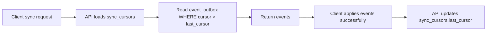

### 11.3 Worker Queue: `worker_jobs` & `worker_job_attempts`

- `worker_jobs` is a generalized async work queue for all background systems.
- Invariants:
  - `status` ∈ `queued|running|done|dead`.
  - `available_at` gates scheduling (for retries, delays).
  - `attempts` increments on each run.
- `worker_job_attempts` stores per‑attempt audit data and errors.
- Typical flow:
  - Producer inserts job with a `kind` and `payload`.
  - Worker claims jobs where `status='queued'` and `available_at <= now()`.
  - On success → `status='done'`.
  - On failure → increment `attempts`, write attempt record, potentially reschedule with backoff or mark `dead`.

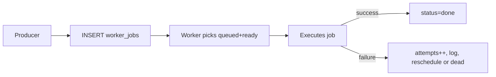

### 11.4 Push & WebSocket Tracking

- `push_tokens`:
  - Maintains mapping of users → device/provider tokens.
  - Uniqueness enforced on `(provider, token)`.
  - Used by workers to broadcast notifications.
- `ws_sessions`:
  - Tracks ephemeral WebSocket connections (`node_id` to identify cluster node).
  - Allows targeted fan‑out and presence detection.

------

## 12. Integrity Gaps & Planned DB-Level Logic

The schema already enforces many invariants via constraints, foreign keys, and helpers. For completeness, here is a conceptual list of **additional logic that is desirable to live in the DB layer** (either via triggers or helper functions), even if currently implemented only in services:

1. **Workspace bootstrap ownership** //solved Nov 18
   - On workspace creation, **ensure the creator becomes `owner` in `workspace_members`**.
   - Implementation option: a `workspace_create` function or `AFTER INSERT` trigger on `workspaces`.
2. **Workspace membership consistency vs board membership** //solved Nov 18
   - Prevent `board_members` rows for users who are not members of the parent workspace, or automatically insert `workspace_members` with minimum role `member`.
3. **Soft delete coherence** // note left on the table
   - When `workspaces.deleted_at` is set, downstream entities (`boards`, `cards`, etc.) may remain soft‑deleted separately, but **eventual consistency rules** should be documented and potentially enforced in maintenance workers (e.g., periodic cascade soft‑delete utility).
4. **Invite expiry enforcement beyond `accept`/`revoke`**
   - Background job to mark old pending invites as `expired` based on `expires_at`, to keep querying simple (no `expires_at` logic in every query).
5. **Attachment lifecycle guarantees** // solved Nov18
   - Workers should respect `attachments.status` state machine and ensure:
     - `ready` files always have a valid `storage_path` and consistent variants.
     - `failed` files stop producing new variants.
6. **Notification fan‑out coherence** // added a table notification_push_log - will keep track of delivery status 
   - For multi‑step flows (mention → notification → push), failures in the last step must not leave DB in inconsistent “half delivered” state. This is handled by **idempotent workers** using `event_outbox` rather than purely by DB code.
7. **Security constraints around revocation**
   - `refresh_tokens`, `file_tokens`, and `invites` all use `revoked`/`status` flags. It is recommended to have db‑level checks or functions that:
     - Always check `revoked` and `expires_at` together to avoid partial misuse.

------

## 13. How to Use This Document

- Treat this as the **single-source conceptual spec** of how data behaves.
- When adding a new feature:
  1. Identify which entity family it belongs to (users, workspace, board, card, messaging, files, invites, sync, workers).
  2. Decide which invariants must hold forever.
  3. Express as much as possible in:
     - Foreign keys and CHECK constraints,
     - Triggers and helper functions,
     - Outbox events.
  4. Only then add service/repository logic on top.

Keeping DB logic and services aligned with these rules is what guarantees StickyBoard remains **robust under high concurrency, offline sync, and multi‑platform access.**