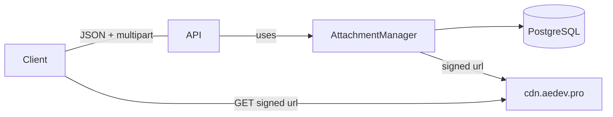
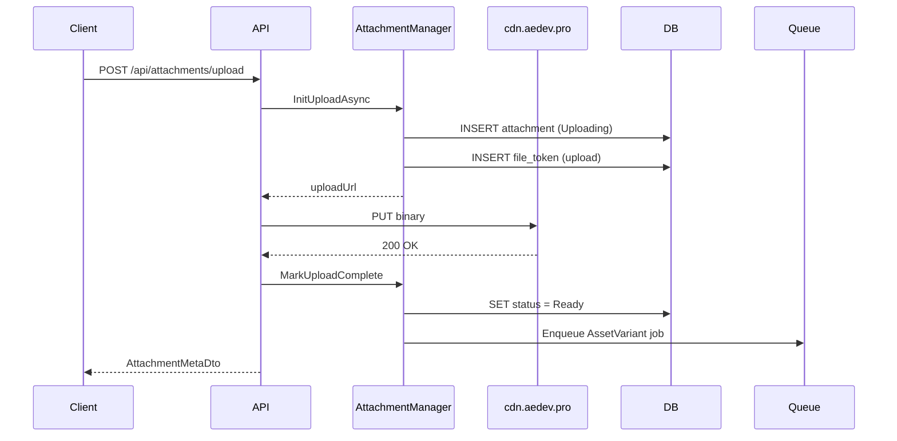
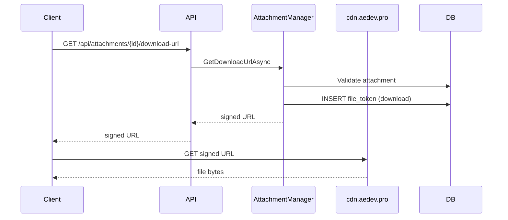
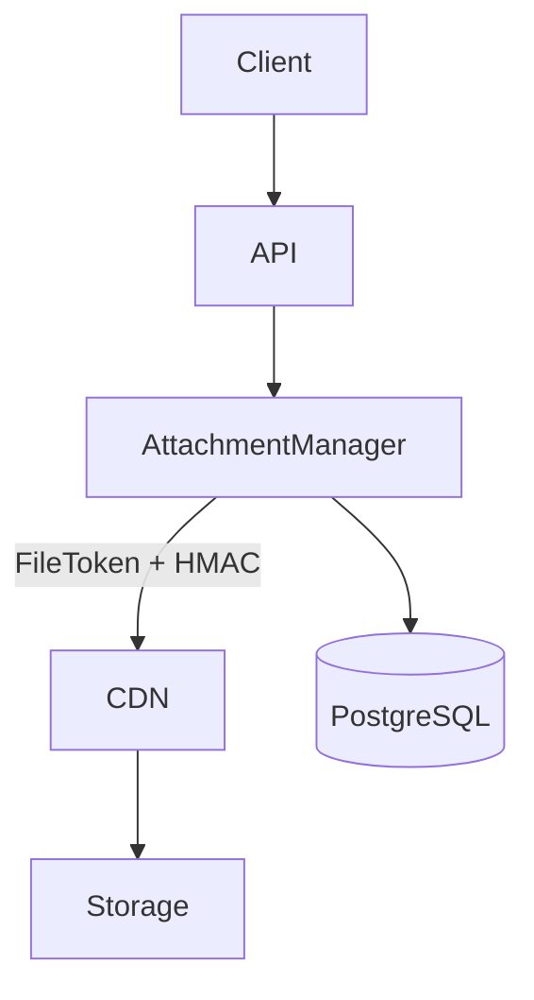
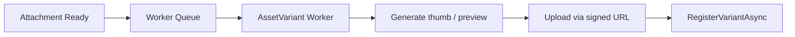

# StickyBoard – File Management Architecture

## Overview

Files never live “inside” the API.
 The API exposes attachment metadata and short-lived signed URLs; the CDN serves the bytes.

Core ideas:

- Attachments and variants are tracked in the DB
- Access is controlled via FileTokens and HMAC signatures
- A single AttachmentManager centralizes:
  - Path conventions
  - Token creation
  - URL signing
  - Attachment/variant metadata
  - Worker integration

This:

- Reduces API load
- Keeps the API stateless regarding file contents
- Centralizes security logic
- Keeps storage layout abstracted from clients

------

## Main Components

### 1. AttachmentManager (central service)

Single service used by:

- HTTP API controllers
- Background workers

Responsibilities:

- Build all storage paths
- Create and update Attachment rows
- Create and update AttachmentVariant rows
- Create FileToken rows with secrets
- Generate signed upload and download URLs
- Provide batch metadata for UI
- Provide original and variant URLs for workers
- Enforce status and availability rules

Key public methods:

- InitUploadAsync(userId, AttachmentInitRequest)
- MarkUploadFailedAsync(attachmentId)
- MarkUploadCompleteAsync(attachmentId)
- GetDownloadUrlAsync(attachmentId, variant)
- GetForCardAsync(cardId)
- GetForBoardAsync(boardId)
- GetForWorkspaceAsync(workspaceId)
- GetOriginalForProcessingAsync(attachmentId)
- GetVariantUploadUrlAsync(attachmentId, variant)
- RegisterVariantAsync(request)
- DeleteAsync(attachmentId)
- RevokeAllTokensAsync(attachmentId)

------

### 2. Attachments

Represents the logical file as seen by the app.

Typical fields:

- Id
- WorkspaceId
- BoardId
- CardId
- Filename
- Mime
- ByteSize
- StoragePath (relative path only)
- Status (Uploading, Ready, Failed)
- IsPublic
- UploadedBy
- CreatedAt, UpdatedAt
- Version

Path convention (centralized in AttachmentManager):

boards/{boardId}/att/{attachmentId}/{variant}/{filename}

Where variant is:

- original for the main upload
- thumb, preview, full, etc. for derived variants

------

### 3. Attachment Variants

Represents derived assets such as thumbnails and previews.

Typical fields:

- Id
- ParentId (Attachment.Id)
- Variant (enum, e.g. Original, Thumb, Preview, Full)
- Mime
- ByteSize
- Width
- Height
- DurationMs
- StoragePath
- Status (Uploading, Ready, Failed)
- ChecksumSha256
- CreatedAt, UpdatedAt
- Version

Workers call RegisterVariantAsync to create or update these once generation is complete.

------

### 4. File Tokens

Short-lived access tickets for a specific attachment and variant.

Typical fields:

- Id
- AttachmentId
- Variant (string or null)
- Secret (byte[], NOT NULL)
- Audience (upload or download)
- ExpiresAt
- CreatedBy
- Revoked
- CreatedAt

AttachmentManager creates tokens and computes the signature on:

path={storagePath}&tid={tokenId}&exp={unixTimestamp}

HMAC-SHA256 over this payload using the per-token Secret produces sig.

The CDN validates:

- token exists and is not revoked
- not expired
- signature matches the stored secret
- path matches the attachment record

------

### 5. DTOs

The public contract for file operations is intentionally small.

- AttachmentInitRequest
- AttachmentInitResult
- AttachmentDownloadResult
- AttachmentMetaDto
- VariantMetaDto
- VariantRegisterRequest

These keep controllers and workers independent from storage details.

------

## Upload Flow

Steps:

1. Client sends multipart with file + boardId + optional cardId
2. API calls InitUploadAsync
3. AttachmentManager creates attachment row and signed upload URL
4. API streams file to CDN using the URL
5. On success, MarkUploadCompleteAsync is called
6. Variant worker job is queued

On failure:

- MarkUploadFailedAsync is called

------

## Download Flow

Only Ready attachments may be downloaded.

------

## Batch Metadata

Endpoints:

- GET /api/attachments/card/{cardId}
- GET /api/attachments/board/{boardId}
- GET /api/attachments/workspace/{workspaceId}

Each returns AttachmentMetaDto with nested VariantMetaDto objects.

Purpose:

- Allow UI to render previews
- Avoid unnecessary downloads
- Show variant availability

------

## Status Lifecycle

| Status    | Meaning                      |
| --------- | ---------------------------- |
| Uploading | Created but not stored yet   |
| Ready     | Stored on CDN and accessible |
| Failed    | Upload or processing failed  |

Only Ready attachments can be signed for download.

------

## Security Model

- Real file paths are never exposed
- All access requires a valid FileToken
- HMAC signature is based on per-token secret
- Tokens are revocable and time-bound

------

## CDN Logic

Protected endpoint:

/validate.php?tenant={tenant}&path={path}&tid={tid}&exp={exp}&sig={sig}

Validation rules:

- tenant is valid
- token exists and is not revoked
- token not expired
- signature matches secret
- path matches attachment or variant

On success, file is streamed using X-Sendfile (or equivalent).

Public endpoint:

/public.php?tenant={tenant}&path={path}

- No token required
- Used only for public assets

------

## Physical Storage Layout

/mnt/ssd/cdn/{tenant}/protected/
 /mnt/ssd/cdn/{tenant}/public/

Database stores only relative paths such as:

boards/{boardId}/att/{attachmentId}/thumb/{filename}

CDN maps relative path to the actual filesystem.

------

## Worker Variant Generation

Steps performed by worker:

1. Call GetOriginalForProcessingAsync
2. Download original
3. Generate variant(s)
4. Call GetVariantUploadUrlAsync
5. Upload variant
6. Call RegisterVariantAsync

All paths and tokens are still controlled by AttachmentManager.

------

- ## Core Rule

  API and Worker control access and metadata CDN controls bytes

  - Uploads use signed PUT
  - Downloads use signed GET
  - Storage is never directly exposed
  - All access is auditable and revocable